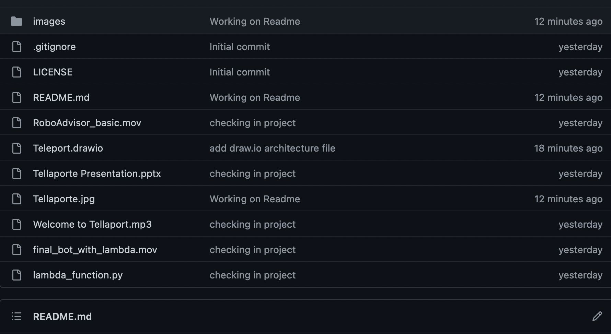
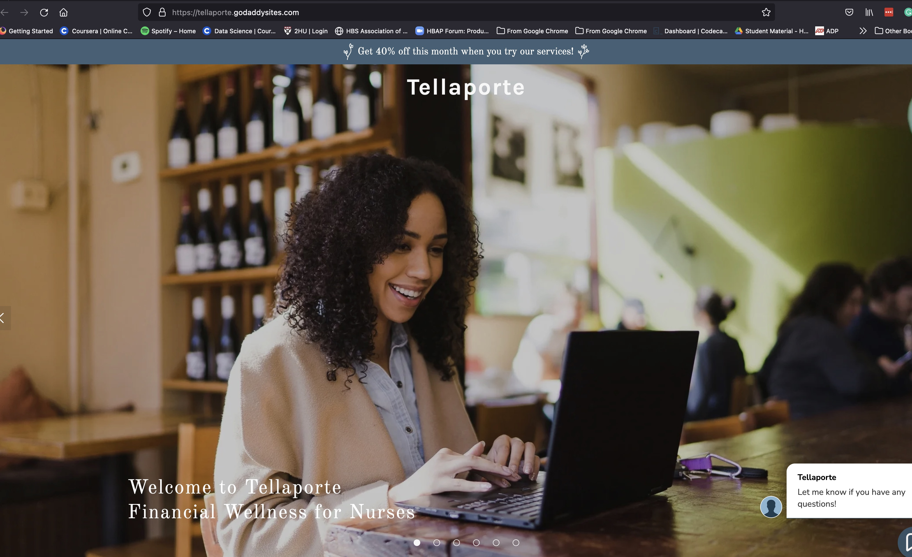

# *Tellaporte*

### By: Pete Petersen and Dakota Braxton

        May 23, 2022  
---
**Welcome to the ETF Analyzer Project we call Tellaporte!**

This project was a collaborative effort between two students enrolled in the Pepperdine Bootcamp Jan 2022 by Pete Petersen and Dakota Braxton.  We were charged with developing a fintech application using some of the techniques we learned in the previous 16 weeks.  Telleporte V2 is the result.  The first phase of the project incorporated analyzing data from the Nasdaq API in a way that we thought would be useful to the final application.  The second project was used to discern an appropriate user interface for our user commmunity of nurses.  In the case, we chose to make a proof of cocept for two different chat user interfaces(CUI) and other other in an Voice Repsonse Unit (VRU) form.  We belive that the knowledge learned from the POC code made this project a success and all of our expectations were met.  Our final decision was that the to CUI's are indeed an appropriate interface and will serve our machine learning and data cleaning techniques needed during during project 3.

# Project 2 Deliverables

This is the second submittal of the Telaport application and focuses on voice bot and chatbot integrations as simple interface for the nurses to interact with.  This interface will be ultimately leveraging the code on the backend from project 1 which will be used to create a database the the lambda functioin can interact with to control several different intent fuffillments.

The repo contains the lambda code, the movies of the chatbot, and the voice recording of a live phone call.

[Tellaporte Project 2 Repo](https://github.com/petepetersen423/tellaport_v2)  

## Project 2 Repository Files



The following are the key delivery files and a description of each.

1. RoboAdvisor_basic.mov - This file is was recorded in quicktime and is a short clip of a user interacting with the robot befor the lambda functions were introduced.  
2. final_bot_with_lambda.mov - This is another quicktime movie that demonstrates three seperate interactions with the main roboadvisor intent named "reccomendPortfolio"  Of Note, are the three distict fufillment messages for each user that vary with the input.  
3. teleport.drawio -  the appliocation architecture diagram of AWS comnponents used
4. Telleport Presentation.pptx -  THe presentation that was used in class
5. Welcome to telleport.mp3.  - The audio recording of a phoned in user that is using Amazon Connect and Poly to interact with the Amazion LEx bot
6. lambda_function.py - This is the Amazon Lambda function code.  This is based on LEX V1 API and was converted to LEX V2.  LEX V@ features were needed for the Connect Contact Flow, so this needs some more debugging. (Code attribution to m15 challenge)

## Technologies

Amazon Connect  
Amazon Lex  
Amazon Lambda  
Amazon Contact Flow
Amazon Polli  
Amazon IAMS  

# Project 1 Deliverables  

[Tellaporte Project 1 Repo](https://tellaporte.godaddysites.com/)  

[Tellaporte Project Website](https://tellaporte.godaddysites.com/)  

[Tellaporte Pitch Deck](https://docs.google.com/presentation/d/1tjTHTjb50yCuq5buGgM85Py6MKm5J6Bn/edit#slide=id.g11a97544c2e_1_11)  

# Background

Tellaporte is a financial wellness application for the community of Nurses. We have chosen Nurses because they are a brilliant and dedicated group of people that give selflessly of themselves almost every day. Because nurses care more for others than themselves and are continuously challenged with life and death every day, they often neglect their health and the health of their retirement. In a nurse's mind, money does not matter relative to the demands of their job and the needs of their patients. With this in mind, we wrote Tellaporte to aid the nurses in financial wellness by simply building an application that speaks the language of nurses so that they can easily understand and correlate their financial wellness in the terminology they already know. Nurses are there for our wellness. Now Tellaporte is there for their financial wellness.

  

## Dependencies  

To begin the project you must clone this repo and install the following dependincies:  

```python

import quandl
import logging
from pathlib import Path
import zipfile
import pandas as pd
import os.path
from dotenv import load_dotenv


```

The /data directory contains all the parquet files needed for the analysis so you do not need to get API keys.  However if you have keys and the files do not exist the app will generate new data.

## Files

    ETF.ipynb
    /data/
        etf_const
        financial_ind
        mer
        prices
        tech_ind
        zacks
